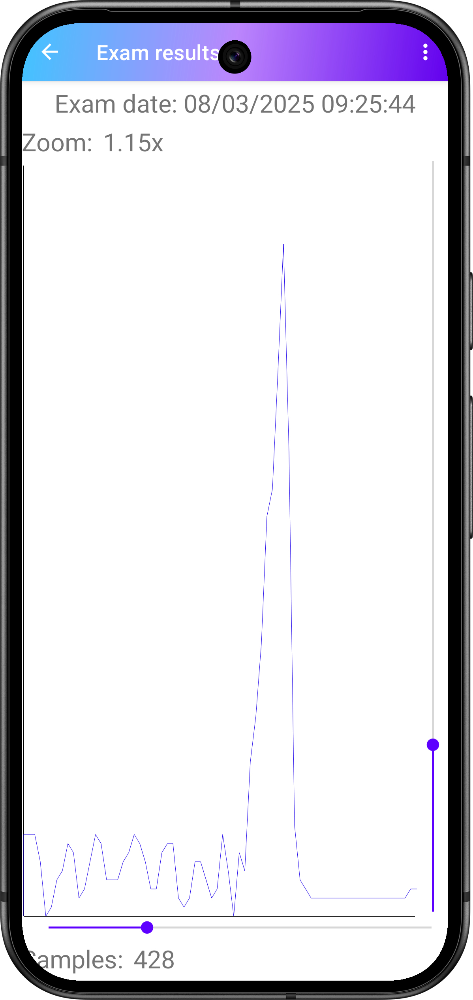
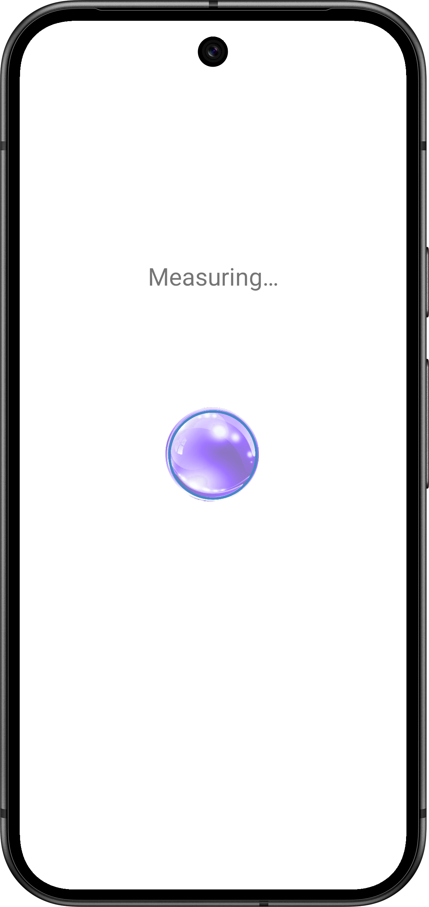

# ripple_release
public repo for the release of the ripple apk for android
Homepage                             |Navigator menu for results           |Result list
------------------------------------:|------------------------------------:|-------------
 ||

Data view                            |Accelerometer exam                            |Touch exam
------------------------------------:|---------------------------------------------:|-------------
||

## Credits
 the homepage icons for the exams are
 imported free versions of fontawesome icons

## Plans for future updates
- fix of strange system behaviour on certain devices with proprietary ui (imui, samsung UI, etc) returning from exams makes the navigation and status bar pop up for 2 seconds
- implementation of vertical scrollbar on the exam results view, for live updating the scale of the values in the graph (increasing its value could reveal smaller value samples, while lowering it could reveal more precise higher fluctuation of values)
- implementation of horizontal scrollbar on the exam results view, for live updating the number of the sampled values in the graph (increasing its value could reveal smaller fluctuations at the cost of more computation, while lowering it could reveal less samples, permitting faster computational times for the graph sample representation)
- rework of the graph samples computation algorithm, adapting the use of the scrollbars to accomodate better samples visualization

